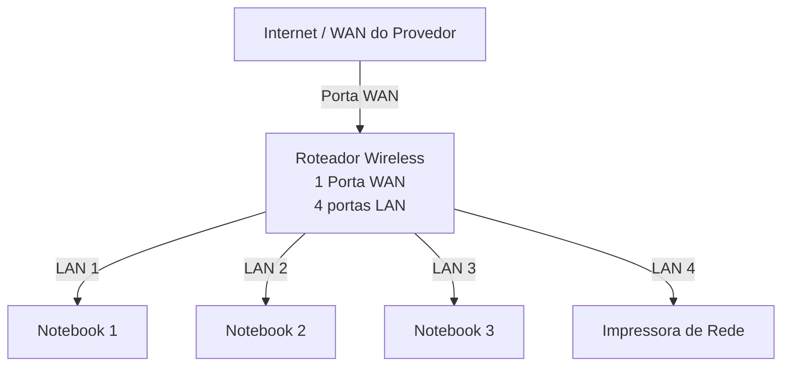
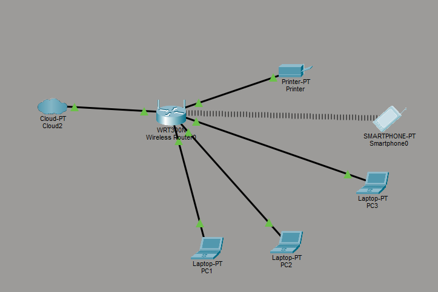

# Laboratório de Redes 01 - Projeto de Rede Local
Projeto desenvolvido na diciplina de Redes de Computadores no Curso Técnico de Informática do SENAC

Aluno: Gabriel Da Silva Alves

Professor: José de Assis 

Data: 09/03/2026

---

## 1. Objetivo
Implementar uma rede local simples conectando 3 notebooks a um roteador wireless com switch integrado e uma impressora de rede.

O projeto será realizado em duas etapas:

1. Simulação da rede no Cisco Packet Tracer
2. Implementação da rede no laboratório real

---

## 2. Equipamentos utilizados neste laboratório

- 3 notebooks
- 1 roteador wireless com 1 porta WAN e 4 portas LAN
- 1 impressora de rede
- cabos de rede

---

## 3. Topologia da Rede
Diagrama lógico da rede utilizada neste laboratório

Imagem da topologia utilizada no laboratório:

## 4. Plano de endereçamento IP

Rede: 192.168.0.0/24
Gateway: 192.168.0.1

 | Dispositivo | Tipo de IP | Endereço IP | Observação | 
 |-------------|-------------|-------------|-------------|
 | Roteador | Estático | 192.168.0.1 | IP do Roteador |
 |Impressora | Reserva DHCP | 192.168.0.100 | IP reservado pelo roteador |
 |PC1 | Reserva DHCP | 192.168.0.101 | IP reservado pelo roteador |
 |PC2 | DHCP | Automático | IP reservado pelo roteador |
 |PC3 | DHCP | Automático | IP reservado pelo roteador |

 **Observação**

 - A imperssora e um dos notebooks utilizam reserva DHCP.
 - O roteador sempre atribui o mesmo endereço IP a esses dispositivos.

---

## 5. Implementação no Laboratório Real

Após a instalação, a rede foi montada fisicamente no laboratório.

Etapas realizadas:

(fotos e capturas de tela realizadas durante o laboratório)

Testes:

(fotos e capturas de tela realizadas durante o laboratório)

---

## 6. Conclusão

Este laboratório permitiu compreender o funcionamento e uma rede local simples, incluindo:

- Estrutura de uma Rede doméstica ou de um pequeno escritório
-   Utilização de um roteador com porta WAN e portas LAN
-   Funcionamento do DHCP
-   Comunicação entre dispositivos na rede local
-   utilização de uma impressora de rede
-   Compartilhamento de pastas na rede
